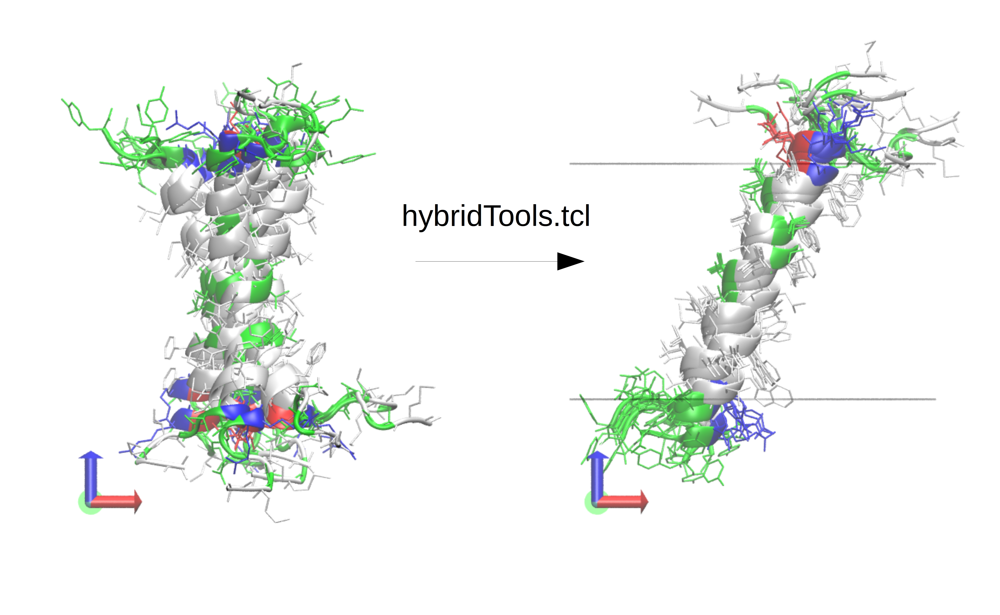
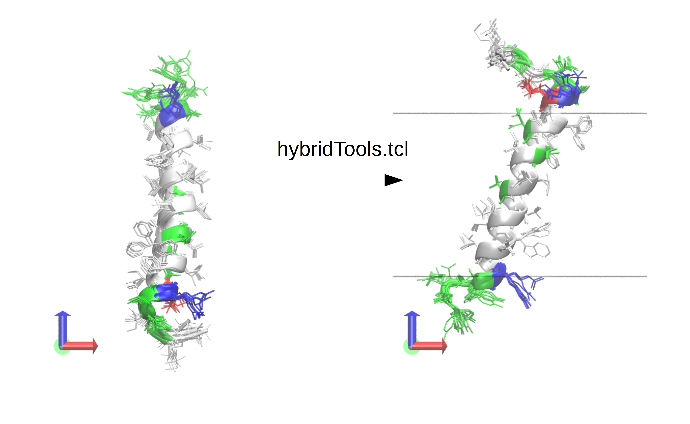

# hybrid-method

Workflow for calculating membrane protein structures in XPLOR-NIH using isotropic and anisotropic NMR restraints. 

## Description

For a brief introduction to combining oriented sample solid-state NMR (OS-ssNMR) and isotropic restraints from solution or MAS-ssNMR, please read/cite our book chapter:

Weber, D. K., Larsen, E. K., Gopinath, T., & Veglia, G. (2020). Chapter 12: Hybridizing isotropic and anisotropic solid-state NMR restraints for membrane protein structure determination. In F. Separovic & M.-A. Sani (Eds.), *Solid-State NMR*. IOP Publishing. https://doi.org/10.1088/978-0-7503-2532-5ch12

This repository details a protocol for determining the structure and topology of membrane proteins by hybridizing isotropic and anisotropic NMR restraints into XPLOR-NIH simulated annealing calculations. The protocol has been updated from our previous versions ([Shi et. al., J. Biol. NMR, 2009](https://doi.org/10.1007/s10858-009-9328-9) and [Mote et al., J. Biol. NMR, 2013](http://link.springer.com/10.1007/s10858-013-9766-2)) to incorporate new functions, force fields and potentials that have since been built into XPLOR-NIH. This protocol has also been designed for non-expert users of XPLOR-NIH and includes the following features:

* Incorporates the [EEFx force field](http://dx.doi.org/10.1016/j.jmr.2014.03.011), with [updated parameters](https://link.springer.com/article/10.1007/s10858-016-0082-5), and the [IMMx implicit membrane model](http://dx.doi.org/10.1016/j.bpj.2015.06.047) introduced by the Marassi Lab.
* A [hybrid.py](hybrid.py) script containing a preset protocol and parameter set. This script is run from a Bash configuration shell script containing the most critical parameters and is not meant to be modified.
* Supports CSA and DC restraints obtained by OS-ssNMR using bicelles (flipped and unflipped).
* [tsv2talos.py](helpers/tsv2talos.py) helper tool to convert a TSV file of chemical shifts into TALOS-N input format.
* [slf2xplor.py](helpers/slf2xplor.py) helper tool to prepare XPLOR-NIH restraint files for CSs and DCs. This applies appropriate scaling corrections to account for bicelle alignment orientation and residual protein/lipid dynamics.
* [hybridTools.tcl](helpers/hybridTools.tcl) library of VMD functions to analyze results. Including:
	* Alignment of helical segments so topology is unaffected (i.e., not applying rotations).
	* Helix tilt and azimuthal angle measurements from atomic coordinates.
* [synthHelix.py](helpers/synthHelix.py) helper tool to generate artificial dihedral and hydrogen bonding restraints for transmembrane segments assumed to be alpha-helical.
* [rfree.py](helpers/rfree.py) script to split CSAs and DCs into free and working restraints.
* All restraining potentials are optional. Just leave options blank in the configuration script if data is unavailable.

List of XPLOR-NIH potentials/classes currently applied in the [hybrid-method.py](hybrid-method.py) script:

* [varTensorTools](https://nmr.cit.nih.gov/xplor-nih/doc/current/python/ref/varTensorTools.html) for setting DC and CSA tensors
* [rdcPotTools](https://nmr.cit.nih.gov/xplor-nih/doc/current/python/ref/rdcPotTools.html) for DCs
* [csaPotTools](https://nmr.cit.nih.gov/xplor-nih/doc/current/python/ref/csaPotTools.html) for CSAs
* XplorPot: CDIH, BOND, ANGL and IMPR for dihedrals, bond lengths, bond angles and improper torsion angles.
* [TorsionDBPotTools](https://nmr.cit.nih.gov/xplor-nih/doc/current/python/ref/torsionDBPotTools.html) for database torsion angles
* [XplorPot HBDA and HBDB](https://nmr.cit.nih.gov/xplor-nih/doc/current/python/ref/protocol.html) for hydrogen bonds
* [noePotTools](https://nmr.cit.nih.gov/xplor-nih/doc/current/python/ref/noePotTools.html) for distance restraints
* [eefxPotTools](https://nmr.cit.nih.gov/xplor-nih/doc/current/python/ref/eefxPotTools.html) for non-bonded terms and implicit membrane
* [EzPot](https://nmr.cit.nih.gov/xplor-nih/doc/current/python/ref/membraneTools.html) for optimizing the depth of insertion.


## Installation

This method requires a UNIX operating system (i.e., MAC-OS or Linux) to install XPLOR-NIH. All commands shown below are executed from a Bash terminal.

* Python 3 (must include numpy)
* [XPLOR-NIH 3.0](https://nmr.cit.nih.gov/xplor-nih/)
* [VMD](https://www.ks.uiuc.edu/Development/Download/download.cgi?PackageName=VMD) (for analysis)

To download, click the green "Code" button above and "Download ZIP". All scripts are executed in the working directory.

## Examples

### Sarcolipin Structure

Sarcolipin (SLN) is a single-pass membrane protein and well-known regulator of the sarco/endoplasmic reticulum Ca<sup>2+</sup>-ATPase (SERCA) pump in skeletal muscle. SLN is a simple protein and a good starting point for learning how to hybridize isotropic and anisotropic NMR restraints into simulated annealing structure calculations in XPLOR-NIH. While this is a just a simple system, the structure and topology of SLN in lipid bilayers is crucial in order to form functional transmembrane protein-protein interactions with SERCA.


#### Step 1: Prepare dihedral restraints

An adequate set of backbone dihedral restraints are usually necessary to obtain the correct fold during simulated annealing. The hybrid.py script will function without these restraints, but calculations will rarely converge on a properly folded structure. If isotropic chemical shifts are available, copy them into a TSV-formatted file like [iso_shifts.dat](examples/sln/input/iso_shifts.dat). The chemical shifts have been taken from MAS-ssNMR of SLN in lipid bilayers ([Mote et al., J Biol NMR, 2013](https://link.springer.com/article/10.1007/s10858-013-9766-2)). These can be prepared using a spreadsheet, then copied into a text file. Make sure the header line is correct and standard atom names are used. Convert this file to a TALOS-N input file using the [tsv2talos.py](helpers/tsv2talos.py) helper script as follows:

```bash
python3 tsv2talos.py -i iso_shifts.dat -o iso_shifts.tls -s MGINTRELFLNFTIVLITVILMWLLVRSYQY
```

This produces the [iso_shifts.tls](examples/sln/input/iso_shifts.tls) that can then be submitted to the [TALOS-N webserver](https://spin.niddk.nih.gov/bax/nmrserver/talosn/) to generate dihedral angle restraints. Note that TALOS inputs can also be generated by Sparky. Take the [pred.tab](examples/sln/input/pred.tab) output file returned by the server and convert it to a restraint file using the [convertTalos](https://nmr.cit.nih.gov/xplor-nih/doc/current/helperPrograms/convertTalos.html) tool included with XPLOR-NIH:

```bash
convertTalos -out iso_shifts.tbl -predFile pred.tab
```

The [iso_shifts.tbl](examples/sln/input/iso_shifts.tbl) can be used as the XPLOR-NIH input. In this particular example, we will instead be using synthetic dihedral restraints (see Step 3) to define the full helical segment since some missing chemical shift assignments will cause convergence issues that will complicate this example calculation. 


#### Step 2: Prepare CSA and DC restraints

Backbone <sup>15</sup>N CSA and <sup>1</sup>H-<sup>15</sup>N DC measurements are usually taken directly from peak positions observed in a PISEMA (or other separated local field, SLF) OS-ssNMR spectrum of the membrane protein aligned using either bicelles or glass plates. Note that the hybrid.py script can be used if either CSA or DC measurements are missing (i.e., if CSA was obtained via oriented 1D <sup>15</sup>N CP spectra or DCs from DIPSHIFT  experiments). CSA and DC restraints must be scaled appropriately to account for the general order parameter associated with rigid-body dynamics of the protein and alignment medium. To perform this scaling, the [slf2xplor.py](helpers/slf2xplor.py) helper tool is available and will output the appropriate CSA and DC restraint tables in XPLOR-NIH format.

To use this tool, first produce a TSV file of residue numbers, names, chemical shifts and dipolar couplings like [ossnmr.dat](examples/sln/input/ossnmr.dat). If values are missing, enter a non-numeric value ("n", "nan" etc.). Do not leave any values blank as the file will not read correctly. For SLN, a [hcSE-SAMPI4](https://link.springer.com/article/10.1007/s10858-019-00273-1) spectrum was acquired in *unflipped* bicelles (--align_order -0.5) and fitted to a general order parameter of 0.9 (--order 0.9) using the [PISA-SPARKY](https://github.com/weberdak/pisa.py) program. If the spectrum was acquired using *flipped* bicelles or glass plates, then the --align_order parameter is set to 1.0 (default).  CSA and DC restraint tables are generated from the [ossnmr.dat](examples/sln/input/ossnmr.dat) file by:

```bash
python3 slf2xplor.py -i ossnmr.dat -o ossnmr --order 0.9 --align_order -0.5
```

This will output three XPLOR-NIH restraint tables: [sln_cs.tbl](examples/sln/input/sln_cs.tbl), [sln_dc.tbl](examples/sln/input/sln_dc.tbl) and [sln_cs_gly.tbl](examples/sln/input/sln_cs_gly.tbl). Note that glycine CSs are treated separately since they require a unique shift tensor. For CSA restraints, the isotropic chemical shift, set as the average of the shift tensor components, are subtracted from the oriented CS observed in SLF spectra. Oriented chemical shifts MUST be [externally referenced correctly](http://dx.doi.org/10.1016/j.ssnmr.2014.03.003). The "reduced" shift is then divided by general order parameter and the order of the alignment medium (i.e., 0.9 * -0.5). DCs are rescaled the same way. In the above command, default <sup>15</sup>N tensor parameters are used, which for backbone amides of non-glycine residues (--pas 57.3 81.2 228.1) are taken from  [Murray et. al., J. Mag. Res., 2014](https://doi.org/10.1016/j.jmr.2013.12.014) and from [Straus et. al., J. Biol. NMR, 2003](https://doi.org/10.1023/A:1024098123386) for glycines (--pas_gly 45.6 66.3 211.6). CSA and DC positions are assumed to have errors of 5 ppm (--error_csa 5.0) and 0.5 kHz (--error_dc 0.5), respectively. This accounts for the linewidths and errors associated with assuming a constant shift tensor for all residues. To modify shift tensors and errors, these options must be explicitly stated in the command line:

```bash
python3 slf2xplor.py \
   	-i ossnmr.dat \
   	-o ossnmr \
   	--order 0.9 \
   	--align_order -0.5 \
   	--pas 57.3 81.2 228.1 \
   	--pas_gly 45.6 66.3 211.6 \
   	--error_csa 5.0 \
   	--error_dc 0.5
```

The [sln_cs.tbl](examples/sln/input/sln_cs.tbl), [sln_dc.tbl](examples/sln/input/sln_dc.tbl) and [sln_cs_gly.tbl](examples/sln/input/sln_cs_gly.tbl) restraint files are now ready to be used as inputs for XPLOR-NIH. If the default PAS components are not used, be sure to also modify these for the XPLOR-NIH calculation as well.

Sometimes it may be desirable to reserve a portion of the oriented restraints to be back-calculated from the structures without applied forces. This can help identify issues with over fitting. If this is desired, the restraint files output from above can be processed further by the [rfree.py](helpers/rfree.py) helper script:

```bash
python3 rfree.py -i ossnmr_cs.tbl ossnmr_dc.tbl ossnmr_cs_gly.tbl -r 20
```

This will randomly reserve (-r) 20% of the CSA and DC restraints for cross-validation and produce 5 additional files: [sln_cs.free.tbl](examples/sln/input/sln_cs.free.tbl), [sln_cs.work.tbl](examples/sln/input/sln_cs.work.tbl), [sln_dc.free.tbl](examples/sln/input/sln_dc.free.tbl), [sln_dc.work.tbl](examples/sln/input/sln_dc.work.tbl), and [sln_cs_gly.work.tbl](examples/sln/input/sln_cs_gly.work.tbl).


#### Step 3: Prepare additional restraints for helical segments

While the backbone dihedral restraints were obtained from MAS-ssNMR and essentially encode the alpha-helical structure of the TM segment, it may also be helpful to reinforce these with synthetic distance (NOE) and hydrogen bonding (HBDA) restraints. Alternatively, these synthetic restraints can be useful when helical structure can be safely assumed (i.e., based on PISA wheel patterns of SLF spectra) and no isotropic chemical shift information is available. The HBDA restraints are also reinforced by the [HBDB knowledge-based potential](https://nmr.cit.nih.gov/xplor-nih/xplorMan/hbdb.html). Since we know that SLN is structured from residues R6 to S28, we can use the [synthHelix.py](helpers/synthHelix.py) helper tool:

```bash
python3 synthHelix.py \
   --start 6 \
   --stop 28 \
   --sequence MGINTRELFLNFTIVLITVILMWLLVRSYQY \
   --start_id 1 \
   --out_prefix sln
```

The --sequence and --start_id options do not need to be specified as they are generally required to scan the sequence for prolines, which SLN does not have. Three files will be written:

* [sln.dihe.tbl](examples/sln/input/sln.dihe.tbl) contains phi (-63 degrees) and psi (-42 degrees) dihedral restraints for the segment. These will be ignored in the calculation since we have experimental ones.
*  [sln.hbnoe.tbl](examples/sln/input/sln.hbnoe.tbl) includes ideal 2.06 angstrom distance restraints from the amide H to the carbonyl oxygen (i-4) atoms.
*  [sln.hbda.tbl](examples/sln/input/sln.hbda.tbl) includes the hydrogen bond restraints (i, i-4).


#### Step 4: Generate starting structure

The [pdbutil webserver](https://spin.niddk.nih.gov/bax/nmrserver/pdbutil/ext.html) is a good tool to generate starting structures. The structure may either be in a folded or extended state. Note that regions will be unfolded during high-temperature stages and likely remain unfolded if no restraints are applied. For this example, the [sln_seq.tbl](examples/sln/input/sln_seq.tbl)  file was used as an input and the structure returned was fully helical.


#### Step 5: Running the simulated annealing calculation

Now that all of the restraint tables and input files have been prepared, we are ready to run the first simulated annealing stage. The [hybrid.py](hybrid.py) protocol is run customizable BASH script ([hybrid_fold.sh](examples/hybrid_fold.sh)):

```bash
#!/bin/bash -l
#SBATCH --time=24:00:00
#SBATCH --ntasks=24
#SBATCH --mem=16g
#SBATCH --tmp=16g
#SBATCH --mail-type=ALL  
#SBATCH --mail-user=dweber@umn.edu

cd /home/vegliag/dweber/xplor_data/20210325_SLN

# Folding
echo "Folding protein."
xplor -py -smp 24 -o logfile.out hybrid.py \
      --structure_in      input/sln_ext.pdb \
      --DC_NH_work        input/sln_dc.tbl \
      --CSA_N1_work       input/sln_cs.tbl \
      --CSA_N1_gly_work   input/sln_cs_gly.tbl \
      --DC_NH_free        "" \
      --CSA_N1_free       "" \
      --CSA_N1_gly_free   "" \
      --HBDA              input/sln.hbda.tbl \
      --NOE               input/sln.hbnoe.tbl \
      --DIHE              input/sln.dihe.tbl \
      --DC_NH_max         10.735 \
      --nstructures       1000 \
      --CSA_N1_tensor     57.3 81.2 228.1 \
      --CSA_N1_tensor_gly 45.6 66.3 211.6 \
      --CSA_N1_beta       -17.0 \
      --CSA_N1_beta_gly   -21.6 \
      --tm_domain         12 24 \
      --immx_thickness    25.72 \
      --immx_nparameter   10 \
      --w_slf             5 \
      --w_r               3 \
      --seed              4534 \
      --highTempSteps     25000 \
      --initialTemp       3500 \
      --finalTemp         25 \
      --stepTemp          12.5 \
      --annealSteps       201 \
      --unfold            yes \
      --resetCenter       yes \
      --repelStart        yes \
      --ezPot             "resid 0:31"

# Mark best structures and move to folder
echo "Getting best folded structures according to XPLOR."
getBest -num 10 -symlinks
rm -rf out.fold
mkdir out.fold
mv *.sa* out.fold/
mv logfile* out.fold/

# Run summary statistics
echo "Getting best folded structures using summary.py"
rm -rf summary.fold
mkdir summary.fold
cd summary.fold/
python3 ../summary.py \
	--folders ../out.fold \
	--terms DIPL_w CS_w CDIH BOND ANGL IMPR EEFX \
	--R_dc_work amide_NH_work \
	--R_dc_err 0.5 \
	--R_csa_work amide_N1_work amide_N1_gly_work \
	--R_csa_err 5.0 > summary.out
cd ../
```

which is run on the Minnesota Supercomputing Institute (MSI) cluster by:

```bash
sbatch -p small hybrid_fold.sh
```

Alternatively, the script can be slightly modified and run locally by:

```bash
bash hybrid_fold.sh
```

Running this shell script avoids having to edit the hybrid.py program, which requires a good understanding of both XPLOR-NIH and Python scripting. This generic method is a good starting point to solving the structure and topology of simple single-pass helical membrane proteins. However, if more complicated systems are to be solved, such as multi-pass proteins, beta-barrels and oligomers, the hybrid.py and BASH scripts will have to be developed further to handle additional restraint types.


##### Notes about specifying restraints

###### Optional parameters
All restraints (DC_NH_X, CSA_N1_X, CSA_N1_gly_X, HBDA, NOE and DIHE) are completely optional and can be excluded from the calculation by simply putting "" in place of the file paths. This is done for the DC_NH_free, CSA_N1_free, and CSA_N1_gly_free restraints in the above example and all CSAs and DCs are set as working restraints.

###### EEFx and IMMx force fields
The basic XPLOR-NIH protocol is taken from ([Tian et al., J. Biol. NMR, 2017](https://doi.org/10.1007/s10858-016-0082-5)) and applies EEFx force field and IMMx implicit membrane model ([Tian et al., Biophys. J., 2015](https://doi.org/10.1016/j.bpj.2015.06.047) ) developed by the Marassi Lab. The IMMx membrane hydrophobic thickness is specified by "--immx_thickness", which for this example is set to the thickness of a DMPC/POPC (4:1 molar ratio) bicelle (25.72 angstroms) as taken from the weighted averages of DMPC and POPC (= 25.4 x 0.8 + 27.0 x 0.2). See p. 379 of the [Handbook of Lipid Bilayers - 2nd Edition](https://books.google.com/books?hl=en&lr=&id=JgnLBQAAQBAJ&oi=fnd&pg=PP1&dq=Marsh,+Handbook+of+lipid+bilayers&ots=t_vN1All4R&sig=yQdbT7LruGwNszFa586dCV1WPX4#v=onepage&q=Marsh%2C%20Handbook%20of%20lipid%20bilayers&f=false) (Marsh, 2013). The IMMx nparameter (--immx_nparameter) defines the transition at the hydrophobic/hydrophilic interface and is set to its default value of 10. Note also that the EEFx parameters are phased in from REPEL terms during the initial high temperature torsion dynamics (set using the --repelStart option).

###### CSA and DC tensors
The maximum <sup>15</sup>N-<sup>1</sup>H dipolar coupling (--DC_NH) is set to the default 10.735 kHz ([Denny et al., J. Mag. Res, 2001](https://doi.org/10.1006/jmre.2001.2405)). The principal axis system (PAS) of the non-glycine chemical shift tensor (--CSA_N1_tensor) is set to the default values of delta11 = 57.3 ppm, delta22 = 81.2 ppm, delta33 = 228.1 ppm ([Murray et al., J. Mag. Res., 2014](http://dx.doi.org/10.1016/j.jmr.2013.12.014)), and the glycine PAS (--CSA_N1_tensor_gly) to the default delta11 = 45.6 ppm, delta22 = 66.3 ppm, delta33 = 211.6 ppm ([Straus et al., J. Biol. NMR, 2003](https://doi.org/10.1023/A:1024098123386)). Note that the <sup>15</sup>N PAS components will be automatically converted to XPLOR-NIH input format. The format specified in the BASH configuration script was chosen as it is more familiar and used throughout the literature. The beta values are set to the defaults of -17.0 and -21.6 degrees as per the above references. Beta values for the <sup>15</sup>N PAS are negative due to the right-hand rule.

###### CSA and DC weighting
The --w_slf and --w_r are the weighting terms for the DC and CSA restraints in the form typically used by the Cross ([Kim et al., J. Am. Chem. Soc., 2001](https://doi.org/10.1021/ja003380x)) and Veglia ([Shi et. al., J. Biol. NMR, 2009](https://doi.org/10.1007/s10858-009-9328-9)) groups. The --w_slf of 5 specifies that the sum of the CSA and DC force constants is 5x that of the torsion angle (DIHE) term (i.e., 5 x 200 kcal/mol = 1000 kcal/mol) and --w_r of 3 specifies that the DC term (i.e., 750 kcal/mol/kHz) is weighted 3x more heavily than the CSA term (i.e., 250 kcal/mol/ppm). These restraints are applied as flat-well potentials in our protocols.


##### The overall protocol

A basic overview:

0. Input PDB structure. Optionally unfold at loading and prior to dynamics (--unfold)*.
1. Initial torsion angle minimization (100 steps)
2. Center protein (--resetCenter)* to membrane then high temperature torsion dynamics with REPEL (A K for 3000 steps) (--repelStart)*. Centering is based on the center of mass of the helical segment specified by the --tm_domain option.
3. Center protein (--resetCenter)* then high temperature torsions dynamics phasing in EEFx parameters (A K for 3000 steps) (--repelStart)*
4. Center protein (--resetCenter)* then high temperature torsion dynamics with only EEFx parameters (A K for B steps)
5. Center protein (--resetCenter)* again then simulated annealing (A K to C K in D K steps, E steps per increment)
6. Minimize insertion depth (Z-position) using knowledge-based Ez-Potential (ezPot)*
7. Powell torsion angle minimization (500 steps)
8. Powell Cartesian minimization (500 steps)

*Optional steps

Settings: 

unfold = 'yes', A(--initialTemp)=3500, B(--highTempSteps)=25000, C(--finalTemp)=25, D(--stepTemp)=12.5, E(--annealSteps)=201, --nstructures=1000, --resetCenter = 'yes', --ezPot = 'resid i:j' (i = first resid, j = last resid)


In the folding protocol, the input structure is reset to a random coil prior to simulating annealing. The depth of insertion in the membrane is also optimized by the empirical [Ez Potential](https://www.sciencedirect.com/science/article/abs/pii/S0022283606012095) in this example by optionally entering the full protein selection (XPLOR language) in the --ezPot field. This stage can be skipped by leaving the field blank with quotations marks (""). If the helical segment specified by the --tm_domain flag is reasonably accurate, then the impact of the Ez Potential will be minimal as minimization of the IMMx/EEFx terms during simulated annealing and Powell stages will do essentially the same thing.

##### Summary statistics

The above example will calculate 1000 structures and at the end will analyze them using the [summary.py](helpers/summary.py) script to produce a [summary.out](examples/sln/output/fold/summary.out) file. This script will find all *.sa files in the out.fold directory (more folders can be appended to this parameter) and rank structures according the lowest energy sum of the DIPL_w CS_w CDIH BOND ANGL IMPR EEFX terms. This will also determine the [R-values](https://pubs.acs.org/doi/10.1021/ja003380x) comparing agreement between the experimental and back-calculated CSA and DC restraints. Note that R-free (of non-working restraints) are computed by specifying options/values "--R_dc_free amide_NH_free" and "--R_csa_free amide_N1_free amide_N1_gly_free". Experimental and back-calculated CSAs and DCs by the top 10 models (default; specify --top X to summarize best X models) are listed at the end of the [summary.out](examples/sln/output/fold/summary.out) file, in which violations are indicated by *. The best X models (and .sa.viols) are also copied to working directory (top.<model>.sa format). 


##### Visualization in VMD

At this point it is useful to visualize the top structures and analyze important features pertaining to membrane proteins such as the tilt and azimuthal (rotation) angles, and depth of insertion in the membrane. VMD functions introduced by the [hybridTools.tcl](helpers/hybridTools.tcl) script streamlines this analysis. First load the top structures into VMD by entering the following into a UNIX command line:

```bash
cd summary.fold/
vmd top.*.sa
```

note that if there are more than 10 files, the structures wont be loaded in the correct order. If for example 20 structures are to be loaded, the order will likely be 0, 1, 10, 11, 12, 13, 14, 15, 16, 17, 18, 19, 2, 3, 4, 5, 6, 7, 8, 9. Therefore, in this case it would be safer to load with the use of the wild card *:

```bash
vmd top.0.sa top.1.sa top.2.sa top.3.sa top.4.sa top.5.sa top.6.sa top.7.sa top.8.sa top.9.sa
```

After loading the structures (visualize all at once using )

The  [analyze.tcl](examples/sln/output/analyze.tcl) 




```tcl
source hybridTools.tcl

# Select TM residues and CA of residue (i-1) to calculation azimuthal angle
set tm [atomselect top "resid 6 to 28"]
set azi [atomselect top "resid 15 and name CA"]

# Compute tilt and azimuthal (Leu16) angles. Align models (only Z-rotations and X-Y translations).
# Note: the azi is directed at the i-1 Ca of the respective residue.
set r [helix_topology $tm $azi -invert -inside C -out results_tilt6-28_azi16.dat -no_z]

# write aligned PDBs
set s [atomselect top "all protein"]
$s set chain A
set num_frames [molinfo top get numframes]
for {set i 0} {$i < $num_frames} {incr i} {
	$s frame $i
	$s writepdb sln.model$i.pdb
}

## Draw membrane
draw delete all
draw color black
set thickness 25.72
draw material Transparent
draw cylinder [list 0 0 [expr ($thickness/2)+0.1]] [list 0 0 [expr ($thickness/2)-0.1]] radius 20 resolution 100
draw cylinder [list 0 0 [expr (-$thickness/2)+0.1]] [list 0 0 [expr (-$thickness/2)-0.1]] radius 20 resolution 100
```


In this example, the helix_topology function does the following to each model:

1. Flips them so the the C-terminus is below the bottom leaflet (-inside C; i.e., it is an ER membrane protein).
2. Measures the tilt angle using the vector between two center of masses (using only N, C, and CA atoms) assigned to the upper and lower halves of the helical segment. The angle is determined in the C -> N direction (-invert).
3. Does a Z-rotation so that the helical segment is aligned perfectly along the X-axis and the X-component of the helix vector is positive.
4. At this point, there is an option (-fix_tilt <angle>) to perform a Y-rotation to fix the tilt to a desire angle. This is not done here, but can be useful for aligning MD trajectories prior to back-calculating SLF spectra using [MD2SLF](https://github.com/weberdak/md2slf). Aligning trajectories like this, especially for single-pass helical proteins, will greatly reduce the convergence time of these calculations.
5. Translates the protein so that the center of mass of the TM segment is at the origin (X = 0, Y = 0). Specifying "-no_z" ensures that the no Z-translations. This is important since the depth of insertion is a feature optimized by XPLOR-NIH and should not in anyway be manipulated.
6. Calculates the azimuthal angle based on the center of mass of the $azi selection, which in this case it is the CA of V15 to provide the azimuthal angle of L16 as per the convention used by [Denny et al. 2001](https://www.sciencedirect.com/science/article/abs/pii/S109078070192405X?via%3Dihub) and the [PISA-SPARKY and pisa.py](https://github.com/weberdak/pisa.py) tools used to fit experimental data. To calculate this:
   1.  The helix is temporarily rotated to zero degrees.
   2. A center of mass is determined using the N, C, and CA backbone atoms of residues i-2 to i+2.
   3. The vector from $azi to the local helical center of mass is determined.
   4. The azimuthal angle is then determined the to magnitudes of the X and Y components of this vector.
   5. The helix tilt readjustment done at step 6.1 is reversed.


The tilt and azimuthal angles for each model are recorded in the results_tilt6-28_azi16.dat file. All models (now aligned) are then written to separate PDBs for publication, deposition, analysis using other visualization package, etc, and the membrane leaflets are drawn. In general, a good calculation will typically show:

1. Polar sidechains should be directed towards the upper (azimuthal angle = 0 degrees) and lower (180 degrees) leaflets.
2. Amphipathic helix at the inter-facial regions
3. Helical length and tilt angle matched to the bilayer thickness.


#### Step 6: Refinement

The refinement

	#!/bin/bash -l
	#SBATCH --time=24:00:00
	#SBATCH --ntasks=24
	#SBATCH --mem=16g
	#SBATCH --tmp=16g
	#SBATCH --mail-type=ALL  
	#SBATCH --mail-user=dweber@umn.edu
	
	cd /home/vegliag/dweber/xplor_data/20210325_SLN
	
	# Folding
	echo "Folding protein."
	xplor -py -smp 24 -o logfile.out hybrid.py \
	      --structure_in      summary.fold/top.0.sa \
	      --DC_NH_work        input/sln_dc.tbl \
	      --CSA_N1_work       input/sln_cs.tbl \
	      --CSA_N1_gly_work   input/sln_cs_gly.tbl \
	      --DC_NH_free        "" \
	      --CSA_N1_free       "" \
	      --CSA_N1_gly_free   "" \
	      --HBDA              input/sln.hbda.tbl \
	      --NOE               input/sln.hbnoe.tbl \
	      --DIHE              input/sln.dihe.tbl \
	      --DC_NH_max         10.735 \
	      --nstructures       1000 \
	      --CSA_N1_tensor     57.3 81.2 228.1 \
	      --CSA_N1_tensor_gly 45.6 66.3 211.6 \
	      --CSA_N1_beta       -17.0 \
	      --CSA_N1_beta_gly   -21.6 \
	      --tm_domain         12 24 \
	      --immx_thickness    25.72 \
	      --immx_nparameter   10 \
	      --w_slf             5 \
	      --w_r               3 \
	      --seed              4534 \
	      --highTempSteps     1000 \
	      --initialTemp       350 \
	      --finalTemp         2.5 \
	      --stepTemp          1.25 \
	      --annealSteps       201 \
	      --unfold            no \
	      --resetCenter       yes \
	      --repelStart        no \
	      --ezPot             "resid 0:31"
	
	# Mark best structures and move to folder
	echo "Getting best refined structures according to XPLOR."
	getBest -num 10 -symlinks
	rm -rf out.refine
	mkdir out.refine
	mv *.sa* out.refine/
	mv logfile* out.refine/
	
	# Run summary statistics
	echo "Getting best refined structures using summary.py"
	rm -rf summary.refine
	mkdir summary.refine
	cd summary.refine/
	python3 ../summary.py \
		--folders ../out.refine* \
		--terms DIPL_w CS_w CDIH BOND ANGL IMPR EEFX \
		--R_dc_work amide_NH_work \
		--R_dc_err 0.5 \
		--R_csa_work amide_N1_work amide_N1_gly_work \
		--R_csa_err 5.0 > summary.out
	cd ../





